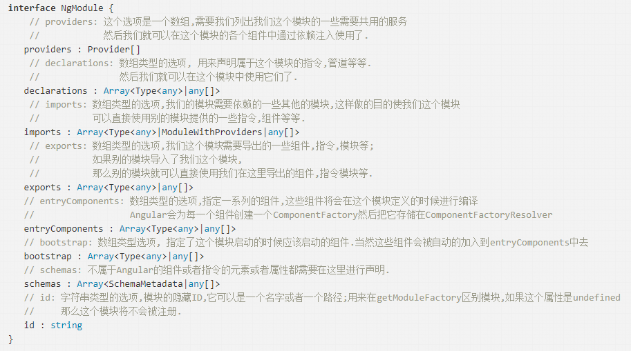

# angular从0初学

> by 2018-08-29
* 主要创建项目，以及简单的修改

> by 2018-08-30
* 创作组建可用 ng generate component name
* 了解 app.model.ts内 [@NgModule](https://segmentfault.com/a/1190000007187393?utm_source=tuicool&utm_medium=referral)  

> by 2018-08-31
* *ngFor、*ngIf、[class.class] 的使用
* 组件功能细分,@Input()的使用
* 使用serve ng generate service name
* 依赖注入
* rxjs的使用，of,Observable,subscribe